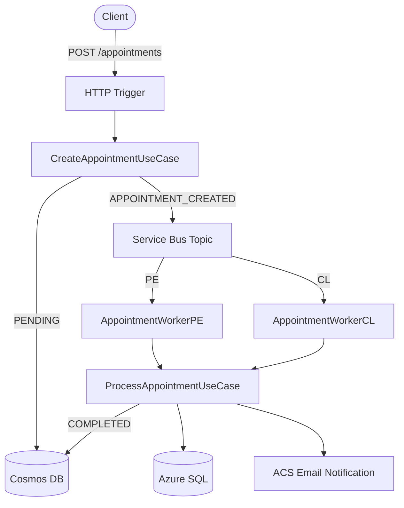

[](https://github.com/apchavez/azure-python/actions/workflows/ci.yml)
[](https://sonarcloud.io/summary/new_code?id=apchavez_azure-python)
[](https://sonarcloud.io/summary/new_code?id=apchavez_azure-python)
[](https://sonarcloud.io/summary/new_code?id=apchavez_azure-python)

# Clinic Scheduling Platform — Azure (Python)

Azure migration of the medical appointment platform originally built on AWS ([aws-typescript](https://github.com/apchavez/aws-typescript), TypeScript). Same business logic and same Clean Architecture — only the infrastructure adapters (and, as of this port, the implementation language) change.

> The domain has no knowledge of Azure. What changes between clouds is exclusively the infrastructure layer; use cases and entities remain intact.

> **Zero cost at rest** — CI only compiles and runs tests. No Azure resources are provisioned until the deploy workflow is triggered manually.

---

## Tech Stack

| Category | Technology |
|---|---|
| Language / Runtime | Python 3.12, Azure Functions Python v2 programming model |
| State store (NoSQL) | Cosmos DB serverless (Managed Identity) |
| Relational persistence | Azure SQL Database (pymssql) |
| Messaging | Service Bus topics + subscriptions (Managed Identity) |
| Notifications | Azure Communication Services Email |
| Resilience | Hand-rolled circuit breaker + exponential retry (mirrors the sibling AWS project's `shared/resilience.ts`) |
| IaC | Bicep (subscription-level deployment) |
| Security | Managed Identity, Key Vault references, HTTPS-only |
| Observability | Application Insights (via `azure-monitor-opentelemetry`), correlation IDs (`contextvars`), structured logs |
| API Docs | OpenAPI 3.0 (validated in CI with Redocly) |
| Build / Tests | pytest, pytest-cov (80% gate on domain + application), ruff (lint + format) |
| CI/CD | GitHub Actions (automatic CI, manual deploy/destroy) |

---

## AWS → Azure Mapping

| AWS (original project) | Azure (this project) |
|---|---|
| AWS Lambda | Azure Functions v4 |
| API Gateway | HTTP trigger (+ optional APIM) |
| DynamoDB | Cosmos DB |
| MySQL / RDS | Azure SQL Database |
| SNS topic | Service Bus topic |
| SQS queue | Service Bus subscription |
| EventBridge | Service Bus topic `appointment-completed` |
| Serverless Framework | Bicep |
| CloudWatch | Application Insights + Log Analytics |

---

## Architecture



Clean Architecture with four well-defined layers:

```
clinic/
├── domain/
│   ├── entities/        Appointment, AppointmentEvent, AppointmentStatus, CountryISO
│   ├── ports/           AppointmentStateRepository, AppointmentRelationalRepository,
│   │                    AppointmentEventPublisher, AppointmentEventStore, AppointmentNotifier
│   │                    (typing.Protocol — structural typing, no base-class inheritance required)
│   ├── shared/          Page[T]
│   └── exceptions.py    IllegalStateError, ForbiddenError
├── application/
│   └── usecases/        create_appointment, get_appointments, get_appointment_history,
│                        process_appointment, cancel_appointment, reschedule_appointment
├── infrastructure/
│   ├── auth/            jwt_validator (hand-rolled HS256), auth_guard
│   ├── config/          app_context (composition root), resilience, correlation_context,
│                        telemetry_context
│   ├── messaging/       service_bus_event_publisher
│   ├── notifications/   acs_appointment_notifier, no_op_appointment_notifier
│   └── repos/           cosmos_appointment_state_repository, cosmos_appointment_event_store,
│                        azure_sql_appointment_repository
└── shared/               api_response, health_status

function_app.py           Azure Functions v2 entry points (HTTP + Service Bus triggers)
```

**Dependency rule:** `infrastructure` / `function_app.py` → `application` → `domain`  
The domain imports no Azure SDKs. Tests run entirely in memory, no cloud required.

---

## End-to-End Flow

```
POST /api/appointments
  → CreateAppointmentUseCase
      → Cosmos DB (status PENDING) + event APPOINTMENT_CREATED
      → Service Bus topic "appointment-created"
          → AppointmentWorkerPE / AppointmentWorkerCL
              → ProcessAppointmentUseCase
                  → Cosmos DB (COMPLETED) + event APPOINTMENT_COMPLETED
                  → Azure SQL (final persistence)
                  → ACS Email (notification to insured)
                  → Service Bus topic "appointment-completed"

DELETE /api/appointments/{id}             → CancelAppointmentUseCase     → CANCELLED
PATCH  /api/appointments/{id}/reschedule  → RescheduleAppointmentUseCase → RESCHEDULED + new appointment
GET    /api/appointments/{id}/history     → immutable event log from Cosmos DB
```

---

## Getting Started

Requires [Azure Functions Core Tools v4](https://learn.microsoft.com/azure/azure-functions/functions-run-local), Python 3.12, and a Cosmos DB account or emulator.

```bash
# 1. Create a venv and install dependencies
python -m venv .venv
.venv/Scripts/activate   # .venv/bin/activate on Linux/macOS
pip install -r requirements-dev.txt

# 2. Configure variables (copy and edit)
cp local.settings.json.example local.settings.json
# Fill in COSMOS_ENDPOINT, SERVICEBUS__fullyQualifiedNamespace, SQL_HOST, SQL_USER, SQL_PASSWORD
# Optionally set APPLICATIONINSIGHTS_CONNECTION_STRING to enable telemetry locally

# 3. Start
func start
```

The function will be available at `http://localhost:7071/api`.

To run only the tests (no cloud, no environment variables):

```bash
pytest --cov=clinic.domain --cov=clinic.application --cov-fail-under=80
```

---

## API Endpoints

Base path: `/api`

| Method | Route | Description |
|---|---|---|
| `POST` | `/appointments` | Create appointment (PENDING → Service Bus) |
| `GET` | `/appointments/{insuredId}` | List appointments with cursor-based pagination |
| `DELETE` | `/appointments/{appointmentId}` | Cancel a PENDING appointment |
| `PATCH` | `/appointments/{appointmentId}/reschedule` | Reschedule a PENDING appointment |
| `GET` | `/appointments/{appointmentId}/history` | Immutable event log for an appointment |
| `GET` | `/health` | Status of Cosmos DB, SQL, and Service Bus |

Full contract: [`src/docs/openapi.yaml`](src/docs/openapi.yaml)

All endpoints except `/health` require a Bearer JWT token in the `Authorization` header:

```
Authorization: Bearer <token>
```

Tokens are **HS256** JWTs with `sub`/`role`/`exp` claims (same shape as the sibling AWS Lambda project's tokens), signed with the secret in `JWT_SECRET` (Key Vault-backed — see [Deploy](#deploy)). Enforcement happens **in the Function itself** (`auth_guard`/`jwt_validator`, `clinic/infrastructure/auth/`), not via API Management — so it's active regardless of whether `deployApiManagement` is enabled. Requests with a missing, malformed, tampered, or expired token get **401 Unauthorized**. `auth_level=func.AuthLevel.ANONYMOUS` on each `@app.route` only means "no Azure Functions key required"; it does not mean unauthenticated.

### Generate a token (dev/testing)

```bash
# HS256 JWT with header {"alg":"HS256","typ":"JWT"} and payload {"sub":"agent-001","role":"agent","exp":<unix-ts>}
# base64url-encode header and payload (no padding), then HMAC-SHA256 the "header.payload" string with JWT_SECRET
```

There's no login endpoint in this portfolio project (same as the AWS Lambda sibling) — generate a token with any HS256 JWT library/script using the `JWT_SECRET` value from Key Vault, or reuse the AWS project's `signJwt` helper (`src/infra/jwt.ts`) since both accept the same token shape.

---

## OpenAPI

The full API contract is at [`src/docs/openapi.yaml`](src/docs/openapi.yaml) — **OpenAPI 3.0.3** with complete request/response schemas, examples, and error codes for all 6 endpoints. The spec is validated automatically on every CI run with Redocly (`ci.yml`).

**Validate locally:**

```bash
npx @redocly/cli lint src/docs/openapi.yaml
```

**Generate static HTML doc:**

```bash
npx @redocly/cli build-docs src/docs/openapi.yaml -o docs/swagger.html
```

---

## Testing

```bash
pip install -r requirements-dev.txt
ruff format --check .
ruff check .
pytest --cov=clinic.domain --cov=clinic.application --cov-fail-under=80
```

Tests run entirely in memory -- no Azure account, no environment variables, and no network connection required.

| Type | Scope | Description |
|---|---|---|
| Unit | Domain & Application | Use cases and entities with hand-written in-memory fakes -- zero Azure dependencies |
| Unit | Infrastructure & API | Adapters and HTTP handlers tested with mocked Azure SDK clients (`unittest.mock`) |

`pytest-cov` enforces **>= 80% coverage** on `clinic.domain` and `clinic.application` only. Infrastructure adapters that require live Azure connections are excluded from the threshold.

---

## Deploy

The deploy is **exclusively manual** via GitHub Actions (`workflow_dispatch`). CI never provisions Azure resources.

```
.github/workflows/
├── ci.yml          Push/PR → build, tests, OpenAPI validation   (no Azure cost)
├── deploy.yml      Manual  → Bicep infra + Function App         (incurs cost)
├── destroy.yml     Manual  → deletes the resource group         (stops cost)
├── cost-guard.yml  Daily   → auto-runs destroy.yml if the dev RG is older than 48h
└── integration.yml Manual  → Postman tests against live env
```

To deploy to Azure, configure the OIDC environment variables (`AZURE_CLIENT_ID`, `AZURE_TENANT_ID`, `AZURE_SUBSCRIPTION_ID`) and the `SQL_ADMIN_PASSWORD`/`JWT_SECRET` secrets in the repository.

`cost-guard.yml` needs no triggering — it runs daily, checks `rg-clinic-dev`'s creation time via Azure Resource Graph, and self-triggers `destroy.yml` if it's older than 48h (configurable via `max_age_hours` on a manual run). No-op if the resource group doesn't exist. Same pattern as the `aws-typescript`/`gcp-go` siblings.

> **Design note — `allowPublicNetworkAccess` defaults to `true`.** Cosmos DB, Service Bus, Storage, Azure SQL, and Key Vault are all reachable over the public internet by default (`infra/core.bicep`). This is a deliberate tradeoff, not an oversight: none of these Bicep templates provision a VNet, subnets, or Private Endpoints, so flipping the default to `false` would make every resource unreachable by the Function App on a default deploy — private networking is a real infra addition (VNet + Private Endpoints + Private DNS zones per service + VNet-integrating the Function App), out of scope for a portfolio-sized deployment. Set `allowPublicNetworkAccess=false` only after adding that networking layer yourself.

---

## Observability

| Signal | Implementation |
|---|---|
| Structured logging | `python-json-logger` — all handlers emit JSON to stdout, captured automatically by Application Insights |
| Tracing / correlation | `azure-monitor-opentelemetry` correlates logs, dependencies, and exceptions across invocations; correlation ID propagated via `contextvars` |
| Health check | `GET /api/health` — pings Cosmos DB, Azure SQL, and Service Bus; returns `UP`/`DOWN` per component |
| Metric alerts | Bicep provisions two Azure Monitor alerts when deployed with `deployAlerts=true` and `alertEmail`: **5xx error rate** (severity 2) and **high latency** (severity 3, avg > 2 s) |

To enable alerts during deploy, pass the parameters to the deploy workflow:

```bash
gh workflow run deploy.yml -f deployAlerts=true -f alertEmail=you@example.com
```

---

## What This Project Demonstrates

- Clean Architecture portable across clouds *and* languages — the domain/application layers were ported from Java to Python with zero business-logic drift
- Azure-native services: Cosmos DB event sourcing, Service Bus fan-out, ACS email notifications
- Managed Identity throughout — no hardcoded credentials anywhere in the codebase
- Hand-rolled circuit breaker + exponential retry (ported line-for-line from the AWS TypeScript sibling's `resilience.ts`) on all external calls
- Cursor-based pagination on Cosmos DB for large result sets
- Bicep IaC at subscription level — full stack provisioned in a single workflow
- OpenAPI contract validated on every CI run with Redocly
- Zero-cost CI design — no Azure resources are created by the CI pipeline

---

## Related Projects

This repo pairs with **aws-typescript** and **gcp-go**: all three implement the same clinic-scheduling domain and Clean Architecture, same 5 endpoints, different cloud/language — kept in functional parity on purpose. The three Kubernetes fullstack projects form a second such group, sharing a Product Management domain instead.

| Project | Description |
|---|---|
| [aws-typescript](https://github.com/apchavez/aws-typescript) | The original AWS version — TypeScript, Lambda, DynamoDB, SNS/SQS. Same domain logic, different cloud |
| [gcp-go](https://github.com/apchavez/gcp-go) | Same clinic-scheduling domain as above, written in Go on GCP Cloud Run with Clean Architecture |
| [quarkus-react](https://github.com/apchavez/quarkus-react) | Product Management platform — Quarkus backend, React frontend, MongoDB, Redis, Kafka events, Kubernetes |
| [spring-angular](https://github.com/apchavez/spring-angular) | Same Product Management domain as above, reactive Spring Boot WebFlux backend, Angular frontend, PostgreSQL, Kafka, Kubernetes |
| [net-vue](https://github.com/apchavez/net-vue) | Same Product Management domain, ASP.NET Core backend, Vue 3 frontend, PostgreSQL, Kafka, Kubernetes |
---

## License

[MIT](LICENSE)
